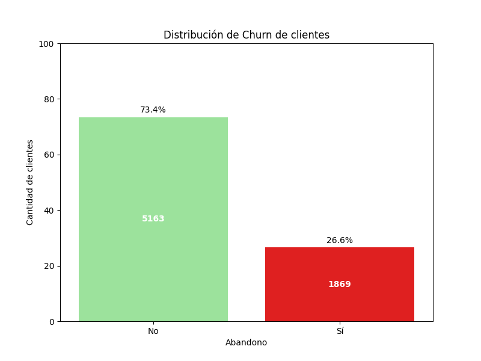
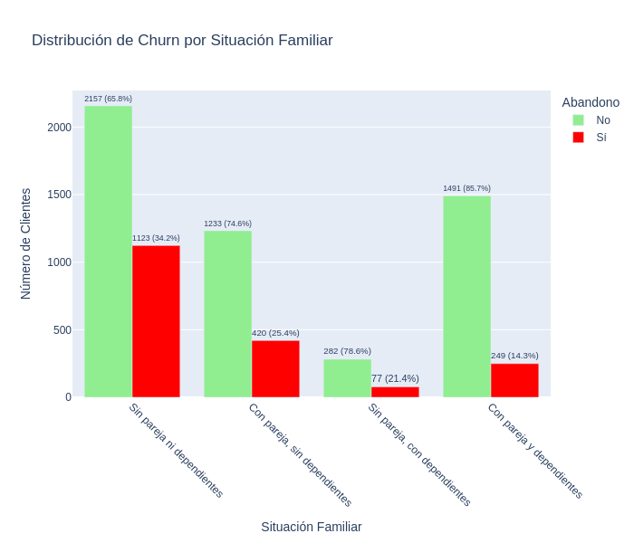
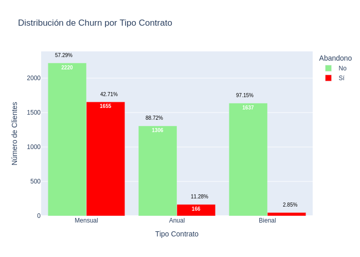
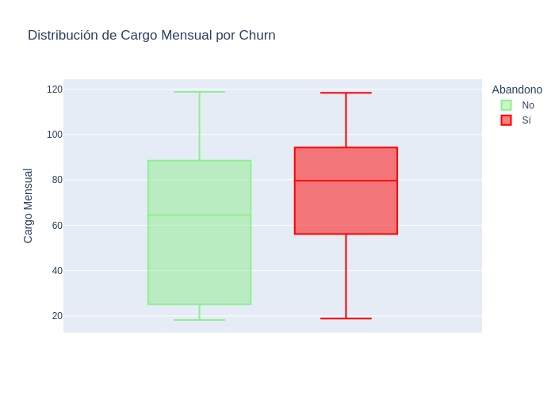
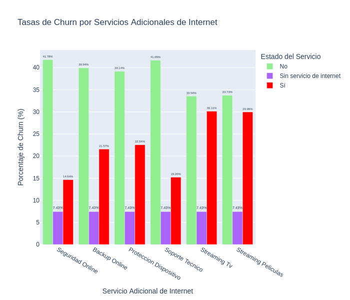

# 📊 Análisis de Churn en Telecomunicaciones

## 📝 Resumen del Proyecto

Este proyecto tiene como objetivo analizar el *Churn* (abandono de clientes) en TelecomX una empresa de telecomunicaciones, identificando los factores clave que influyen en la decisión de los clientes de dejar la compañía. A través de la extracción, transformación y análisis de datos históricos, se busca ofrecer *insights* valiosos y recomendaciones estratégicas para mejorar la retención de clientes.

## ├── 📁 Estructura del Proyecto

El proyecto está organizado en un único *notebook* de Google Colab, siguiendo un flujo lógico de análisis de datos:

1.  **Extracción (`Extracción`):** Carga inicial de los datos desde una fuente externa (JSON) y normalización.
2.  **Inspección y Limpieza (`Inspeccionar Tipos de Datos`, `Inspeccionar Valores Nulos`, `Analizar Valores Únicos en Columnas Tipo Object`, `Valores vacíos o en blanco`):** Revisión de tipos de datos, valores nulos e inconsistencias en las columnas, especialmente en las de tipo `object`.
3.  **Transformación (`Transformación`):** Procesamiento de datos para corregir inconsistencias, eliminar valores atípicos y estandarizar la información. Incluye el manejo de valores vacíos, la conversión de tipos de datos y la estandarización de nombres de columnas y valores categóricos.
4.  **Análisis y Visualización (`Carga y análisis`):** Realización de un análisis descriptivo y exploratorio de los datos, con énfasis en la relación entre diversas variables y el *Churn*. Se generan gráficos para identificar patrones y tendencias.
5.  **Conclusiones y Recomendaciones (`Informe final`):** Presentación de los hallazgos clave y formulación de recomendaciones estratégicas basadas en el análisis para la retención de clientes.

## 📈 Ejemplos de Gráficos e *Insights* Clave

### 📉 Distribución General de Abandono (Churn)

*Insight:* El 73.4% de los clientes no han abandonado, mientras que el 26.6% sí lo han hecho, lo que justifica la necesidad de este análisis.

### 🤝 Churn por Situación Familiar

*Insight:* Los clientes 'Sin pareja ni dependientes' presentan la tasa de Churn más alta (34.24%), mientras que aquellos 'Con pareja y dependientes' tienen la más baja (14.31%), sugiriendo que los compromisos familiares influyen en la lealtad.

### 🌐 Churn por Tipo de Contrato

*Insight:* Los contratos 'Mensuales' tienen una tasa de Churn muy alta (42.7%), en contraste con los contratos 'Anual' (11.3%) y 'Bienal' (2.8%), indicando que la duración del compromiso es crucial para la retención.

### 💰 Churn por Cargos Mensuales

*Insight:* Los clientes con cargos mensuales más altos tienden a tener una mayor probabilidad de Churn, especialmente en contratos mensuales. Esto sugiere que el costo elevado puede ser un factor de abandono.

### 👵 Churn de Clientes Mayores con Cheque Electrónico

*Insight:* Los clientes mayores de 60 años que pagan con 'Cheque electrónico' muestran una tasa de Churn aún mayor (53.4%) que el promedio de usuarios de cheque electrónico, identificando un segmento de muy alto riesgo.

### 🚀 Servicios Adicionales de Internet vs. Churn

*Insight:* La ausencia de servicios adicionales como seguridad online o soporte técnico se asocia con tasas de Churn significativamente más altas, destacando su importancia para la retención.

## 💻 Instrucciones para Ejecutar el *Notebook*

Para ejecutar este *notebook* y replicar el análisis, sigue estos pasos:

1.  **Abre el *notebook* en Google Colab:** Accede al archivo `.ipynb` desde tu cuenta de Google Drive o GitHub.
2.  **Ejecuta todas las celdas en orden:** Puedes hacerlo utilizando la opción **Ejecutar todas** del menú **Entorno de ejecución**. Esto cargará los datos, realizará la limpieza, las transformaciones y generará todos los gráficos y análisis presentados.
3.  **Visualiza los resultados:** Los *insights* y las visualizaciones se mostrarán a lo largo del *notebook*, así como en la sección final de conclusiones.
